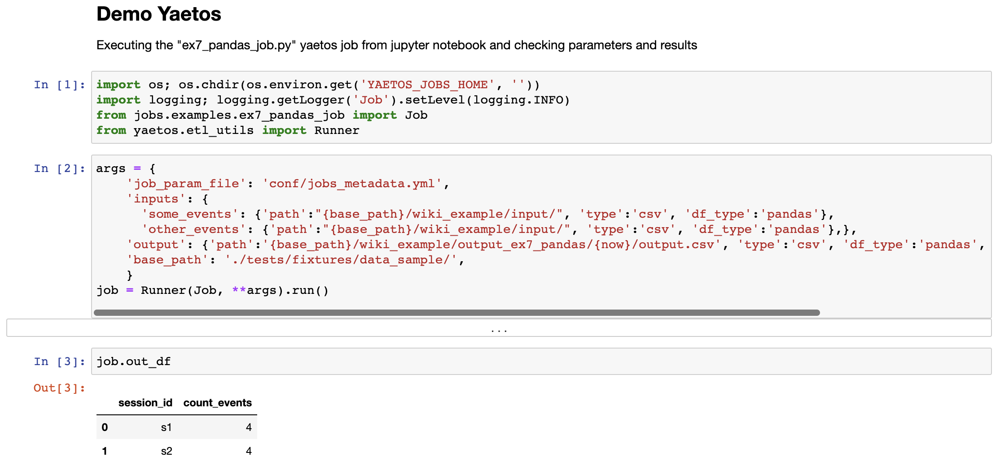

	

# Yaetos
Yaetos is a framework to write data pipelines on top of Pandas and Spark, and deploy them to Amazon Web Services (AWS). It can run locally or on AWS (using S3 datasets and running the process on an AWS cluster). The focus is on making simple things easy and complex things possible (and as easy as can be). It's name stands for "Yet Another ETL Tool on Spark".
 - In the simplest cases, pipelines consist of SQL files only. No need to know any programming. Suitable for business intelligence use cases.
 - In more complex cases, pipelines consist of python files, giving access to Pandas, Spark dataframes, RDDs and any python library (scikit-learn, tensorflow, pytorch). Suitable for AI use cases.

It integrates several popular open source systems:

  
  &nbsp;&nbsp;&nbsp;&nbsp;
   
  &nbsp;&nbsp;&nbsp;&nbsp;
  
  &nbsp;&nbsp;&nbsp;&nbsp;
  

<!-- CSS options for above, to be tested: style="width:auto;height:50px;margin-right:20px" -->

Some features:
 * The ability to run jobs locally and on a cluster in the cloud without any changes.
 * The support for dependencies across jobs
 * The support for incremental jobs
 * The automatic creation of AWS clusters when needed.
 * The support for git and unit-tests
 * The ability to integrate any python library in the process (ex: machine learning libraries).

## To try

https://user-images.githubusercontent.com/3277100/175531451-1931086d-866a-40a8-8b1d-0417f8928b66.mp4

Run the commands from the "installation instructions" section below. Then run [this sql example](jobs/examples/ex1_sql_job.sql) locally with:

    yaetos run_dockerized jobs/generic/launcher.py --job_name=examples/ex1_sql_job.sql

It will open the manifesto file (`jobs_metadata.yml`), find the job called `examples/ex1_sql_job.sql`, i.e. [these lines](conf/jobs_metadata.yml#L7-L16), get the job parameters from there (input paths, output path...), execute the transform defined in the job [ex1_sql_job.sql](jobs/examples/ex1_sql_job.sql) using sparkSQL engine, and dump the output [here](conf/jobs_metadata.yml#L12). To run the same sql example on an AWS cluster, add `--deploy=EMR` to the same command line above. In that case, inputs and outputs will be taken from S3, as defined by the `base_path` param in the manifesto [here](conf/jobs_metadata.yml#L214). If you don't have a cluster available, it will create one and terminate it after the job is finished. You can see the status on the job process in the "steps" tab of your AWS EMR web page.

For the rest of the documentation, we will go in the docker environment with the following command, and will execute the commands from there.

    yaetos launch_docker_bash

To run an ETL that showcases manipulation of a spark dataframes, more flexible than the sql example above, run this frameworked pyspark example [ex1_frameworked_job.py](jobs/examples/ex1_frameworked_job.py) with this:

    python jobs/examples/ex1_frameworked_job.py

To try an example with job dependencies, run [ex4_dependency4_job.py](jobs/examples/ex4_dependency4_job.py) with this:

    python jobs/examples/ex4_dependency4_job.py --dependencies

It will run all 3 dependencies defined in [the jobs_metadata registry](conf/jobs_metadata.yml#L57-L87). There are other examples in [jobs/examples/](jobs/examples/).

To explore jobs in jupyter notebooks, from the host OS:

    yaetos launch_docker_jupyter

Then, open a browser, go to `http://localhost:8888/tree/notebooks`, open  [inspect_ex4_dependencies4_job.ipynb](notebooks/inspect_ex4_dependencies4_job.ipynb). It will look like this:

## Development Flow

To write a new ETL, create a new file in [ the `jobs/` folder](jobs/) or any subfolders, either a `.sql` file or a `.py` file, following the examples from that same folder, and register that job, its inputs and output path locations in [conf/jobs_metadata.yml](conf/jobs_metadata.yml). To run the jobs, execute the command lines following the same patterns as above:

    python jobs/generic/launcher.py --job_name=examples/some_sql_file.sql
    # or
    python jobs/examples/some_python_file.py

Extra arguments:
 * To run the job with its dependencies: add `--dependencies`
 * To run the job in the cloud: add `--deploy=EMR`
 * To run the job in the cloud on a schedule: add `--deploy=airflow`

Jobs can be unit-tested using `py.test`. For a given job, create a corresponding job in `tests/jobs/` folder and add tests that relate to the specific business logic in this job. See [tests/jobs/ex1_frameworked_job_test.py](tests/jobs/ex1_frameworked_job_test.py)for an example.

Depending on the parameters chosen to load the inputs (`'df_type':'pandas'` in [conf/jobs_metadata.yml](conf/jobs_metadata.yml)), the job will use:
 * Spark: for big-data use cases in SQL and python
 * DuckDB and Pandas: for normal-data use cases in SQL
 * Pandas: for normal-data use cases in python

## Unit-testing
... is done using `py.test`. Run them with:

    yaetos launch_docker_bash
    # From inside the docker container
    pytest tests/*

## Installation instructions

https://user-images.githubusercontent.com/3277100/175531551-02d8606e-8d2c-4cd9-ad8c-759711810fd7.mp4

To install the library and create a folder with all necessary files and folders:

    pip install yaetos
    cd /path/to/an/empty/folder/that/will/contain/pipeline/code
    yaetos setup  # to create sub-folders and setup framework files.

An example of the folder structure is available at [github.com/arthurprevot/yaetos_jobs](https://github.com/arthurprevot/yaetos_jobs) with more sample jobs. The tool can also be used by cloning this repository, mostly for people interested in contributing to the framework itself. Feel free to contact the author if you need more details on setting it up that way.

The setup comes with a docker environment with all libraries necessary (python and spark). It also comes with sample jobs pulling public data. To test running one of the sample job locally, in docker:

    yaetos run_dockerized jobs/examples/ex1_frameworked_job.py --dependencies

The docker container is setup to share the current folder with the host, so ETL jobs can be written from your host machine, using any IDE, and run from the container directly.

To get jobs executed and/or scheduled in AWS, You need to:
 * fill AWS parameters in `conf/config.cfg`.
 * have `~/.aws/` folder setup to give access to AWS secret keys. If not, run `pip install  awscli`, and `aws configure`.

To check running the same job in the cloud works:

    yaetos run_dockerized jobs/examples/ex1_frameworked_job.py --dependencies --deploy=EMR

The status of the job can be monitored in AWS in the EMR section.

## Potential improvements

 * more unit-testing
 * integration with other resource provisioning tools (kubernetes...)
 * adding type annotations to code and type checks to CI
 * automatic pulling/pushing data from s3 to local (sampled) for local development
 * easier dataset reconciliation
 * ...

Lots of room for improvement. Contributions welcome.
Feel free to reach out at arthur@yaetos.com
